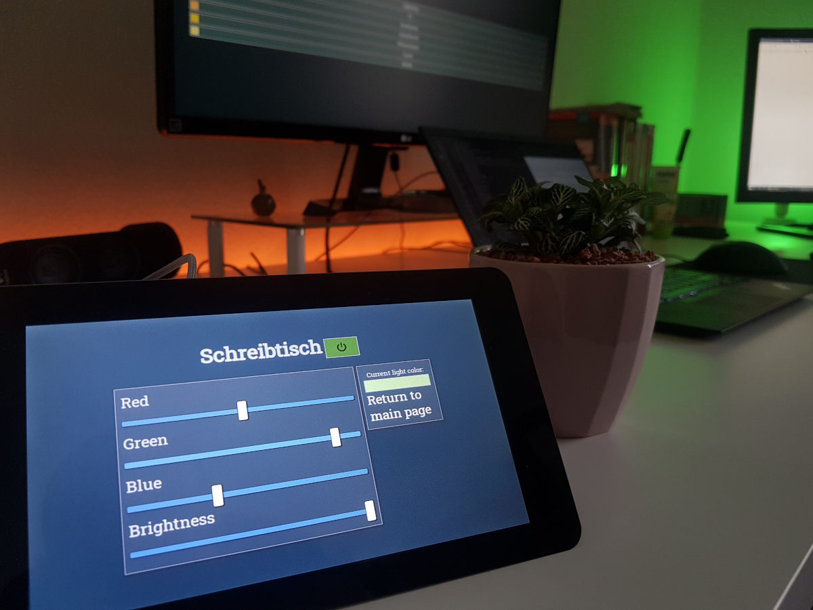

# NodeHue

A controller app for the Philips Hue lighting system. Can currently scan the local network for a bridge, 
read all light info and provide a simple touch-friendly interface for turning specific lights off and on and changing their color/brightness.

This application is optimized for display on a Raspberry Pi with the official 7" touch screen display.

